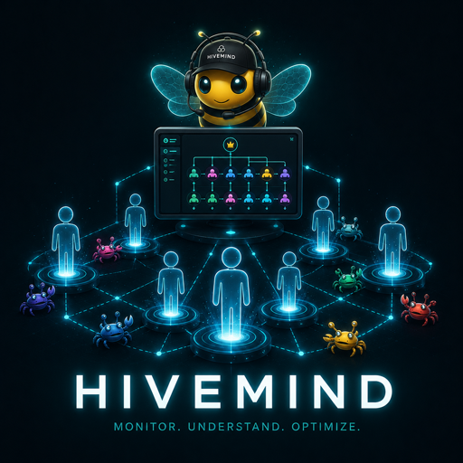
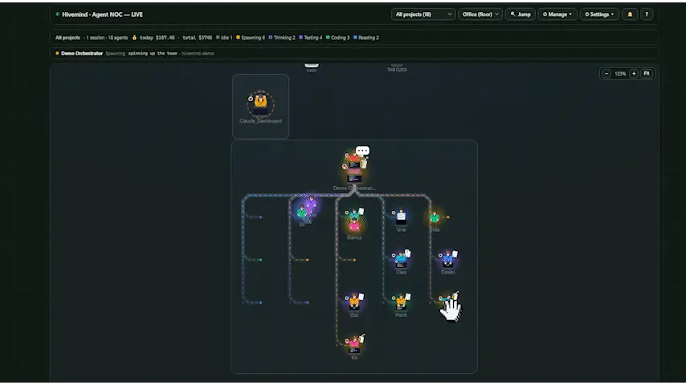

<p align="center"></p>

# Gander

> *Take a gander at your agents.* The ambient control room for Claude Code — see every agent, get pinged anywhere the moment one needs you, and keep your whole setup lean.

<p align="center"></p>

A live, animated dashboard of your **Claude Code agents and sub-agents** — a Hollywood-Squares / Zoom-style grid where each agent is a pixel-art avatar that physically acts out what it's doing: thinking, reading, coding, spawning sub-agents, running tests, erroring, idling. Parent and child agents are linked with curved connectors carrying **animated packets that flow downward** to show information moving through the hierarchy.

It attaches to any project automatically via Claude Code **hooks** — no manual wiring once installed.

> **Claude Code now ships a built-in agent list (`claude agents`).** Gander is the layer around it. It **reaches you when you've stepped away** — a desktop toast, your phone, even a smart light across the room — so you never have to sit and watch. And it's a **control center for your whole Claude Code setup**, not just what's running this minute: trim dead weight (and pasted secrets) from your CLAUDE.md, catch a session burning money, kill a stuck dev server, manage every project's skills / MCP / hooks, all from one screen or your phone.

<p align="center"></p>
<p align="center"><em>idle · thinking · coding · spawning · reading · testing · error · done — every agent, live.</em></p>

<p align="center"><a href="https://youtu.be/URRkwBjsVmQ"><strong>📺 Watch the demo</strong></a> — running a dozen Claude Code agents at once</p>

<p align="center"><a href="https://www.paypal.com/ncp/payment/G8NNLNUHD6SFW"></a></p>

## What you get

- **Live agent tiles** — one per session/sub-agent, driven by real tool activity.
- **Persistent Orchestrator root** — the main session is always present (idle when quiet) as the root of the tree.
- **Recursive hierarchy view** — connectors from each agent to its sub-agents at any depth, with subtree hover-highlight and animated parent→child flow.
- **Office floor + Mosaic views** — a top-down animated office where agents walk, gather at the water cooler, and route packets to their sub-agents; or a compact responsive tile grid.
- **3 avatar tiers** — pixel art (procedural Canvas), abstract (waveforms/EQ/rings), and top-down desk people / your own images.
- **Click any agent** — a modal to read its **current task and live message** (sub-agents stream what they're doing *as they work*, not just at finish), open a **💬 live conversation** view (the whole thread, read straight from the transcript on disk — no model calls, so following along costs nothing), reply, stop it, **focus its window** (raise the live terminal), or open its folder / VS Code. For a **clocked-out** session with no open window, **⤳ Resume** replies by resuming it headlessly — a real turn on **your own `claude` login** (plan quota, no API key injected), same as typing it in the terminal.
- **Per-session analytics** — each agent's modal shows efficiency gauges parsed from its transcript: **cache-hit %** (context reused vs re-sent), **output-cost share** (verbose answers vs context bulk), and a **context-window bar** that fills amber→red toward the model limit. When a parked session is near full, a **Compact now** nudge types `/compact` for you — freeing context and the cache-read you'd pay on every later turn. From there, **Audit CLAUDE.md** opens a before/after diff of your CLAUDE.md: it flags **pasted secrets** (remove + rotate), lines pointing at **files that don't exist** plus generic boilerplate (red, checked by default), and possibly-stale prose — old to-dos, planning sections, dated notes, moved paths (amber, opt-in) — and **suggests additions** (undocumented npm scripts, frameworks, config). It's deterministic and **compact-proof** (checks files on disk, not the transcript). Tick/untick each line and **Apply** writes the trimmed file (backed up to `CLAUDE.md.bak`); guardrails, commands, real files, and prose are kept.
- **⚡ Gander Dispatch (optional, toggleable)** — host sessions **inside the bridge** instead of terminal windows, over Claude Code's bidirectional stream-json. Replies deliver **instantly** (no window automation), **permission prompts become real Allow / Deny buttons** (with the exact tool + input, and an "Allow & don't ask again" when Claude suggests a rule), Stop interrupts the current turn, and ⤳ Resume re-hosts a parked session. Runs on **your own `claude` login** — plan quota, no API key. Flip it off in Settings (or per-launch) to go back to the classic terminal launch + quick-keys — nothing is removed. Hosted sessions still write normal transcripts, so history/resume/cost all keep working.
- **"Needs you" triage rail** — the 🔔 bell lists every session waiting on a human across all projects — needs input, errored, finished — ranked, each with the reason and how long it's waited. Answer an awaiting prompt inline with the quick-keys — or, for dispatched sessions, **✓ Allow / ✕ Deny the exact permission right in the rail**. The badge turns red only when a human is actually needed.
- **Live cost + runaway alerts** — each agent tile shows its session spend, and any agent burning money fast (a stuck/looping session) lights up red with a `💸 $/min` badge so you can catch it and stop it before it runs up a bill. Toggle off in Settings if you don't care about spend.
- **Plan-quota pacing** — subscription plans meter on a rolling **five-hour window**, so the status bar shows `⚡ 5h $X` (what landed in the current window) and — once any dispatched session reports a `rate_limit_event` — the window's **real reset time**. If the CLI reports the limit hit, the chip turns red and a banner says when you're back.
- **⏪ Session replay** — scrub any session (running or finished) on a timeline: a color strip of its states, a playhead with ▶ playback (10–120×), what tool ran when, and **cumulative tokens/cost at every moment**. "What did that agent do for 40 minutes and $6" becomes a two-minute post-mortem. From the ⏪ buttons in an agent's modal and Session history. Pure transcript reads — costs nothing.
- **🖥 Fleet (multi-machine)** — run Gander on your desktop, laptop, and a VPS, and see **every machine's agents on one floor**. Add peers in Settings → Fleet; remote tiles carry a 🖥 machine badge and replies/stops are **forwarded to the owning machine's bridge**. Secured by the remote-access token; Tailscale-friendly (see [docs/REMOTE.md](docs/REMOTE.md)).
- **📱 On your phone** — the dashboard is an installable **PWA** (add-to-home-screen, standalone window, offline shell). Pair it with the remote-access token + Tailscale and you can watch the floor, reply, and **Allow/Deny permissions from bed** — the full recipe is in [docs/REMOTE.md](docs/REMOTE.md).

## Control center — manage Claude Code, not just watch it

Beyond visualization, Gander is a local control panel for everything Claude Code on your machine (top-bar buttons; every side panel is **resizable** — drag its left edge, and the width is remembered):

- **Projects** — the one place for everything per-project. Every Claude project (running, recently active, or discovered from folders you add — typed or via a native picker) shows the components it uses: skills, agents, commands. Copy any component between projects (or to/from your global `~/.claude`, with an overwrite confirm); see per-project **git status** (branch · dirty · ahead/behind); **▶ Start** a new session, or **↪ Send to open** to type a task into an *already-open* window for that project instead of starting a duplicate (handy when a session went idle but its window's still up); **Pull** or **Commit & Push** in place. **Expand a project** to also manage its **hooks** (view + delete), **MCP servers** (add from a preset / remove), and raw **`settings.json`** — right where the project lives.
- **📋 Task queue** — line up goals per project and the bridge **starts the next one the moment a slot frees** (default 2 slots; never two tasks in one project; never on top of a session that's already working there). Runs via Dispatch when it's on — precise completion from the turn result — or classic terminal launches when it's off. Done/failed tasks hit the activity feed + ambient alerts; failures ping Telegram. Queue from the panel or the **📋 Queue** button in ＋ New task. Survives bridge restarts.
- **Usage** — token & cost analytics parsed from your `~/.claude` transcripts (including sub-agent sessions): total spend, 30-day chart, per-project / per-model breakdowns, priciest sessions. Today's + total spend also show live in the status bar.
- **📰 Ship digest** — "what actually got done": sessions + recent goals per project (from transcripts) and commits in range (from each project's git log) over 7/14/30 days, with a **copy-as-markdown** button for standups/notes. Deterministic — zero model calls.
- **GitHub** — open PRs and issues per project via the `gh` CLI, click to open in the browser.
- **Memory** — view and edit what Claude remembers: the **`CLAUDE.md`** it loads every session (global `~/.claude` or any project) and the `.claude/memory/*.md` fact store — read, edit, or delete each fact, plus the `MEMORY.md` index.
- **Routines & briefings** — save reusable prompts that call your skills/MCP (e.g. a *Morning Brief* that checks mail, calendar & news), **Run now** or **schedule** them daily at a set time. They run **headlessly** (`claude -p`) and their output lands on the dashboard as a **briefing** — a fresh one greets you with a card and can ping Telegram/desktop. "What did I miss overnight?", answered.
- **History** — recent sessions across all projects with their first prompt; **▶ Resume** any one (`claude --resume <id>` in a terminal), **⏪ Replay** it on the timeline scrubber, or copy the command.
- **Processes** — the long-running / port-holding processes your sessions spawned and **left open** — a dev server still on `:3000`, a stray `node`/`python`. Gander can't see these from hooks (the tool call returns while the process keeps living), so it scans the OS, attributes each to the session whose window spawned it (orphans grouped apart), and gives you a one-click **Kill** (force-kills the tree). Each agent's modal also lists what *that* session left running. *(Windows-first.)*
- **Tune** — mines your recent session transcripts for repeated work and suggests the config that removes it: a **PostToolUse hook** for a command you keep running after edits (with a copy-paste snippet), or a **`/command` / routine** for a prompt you keep typing. Deterministic counts; nothing is auto-written — you copy what's useful.
- **Skills (all projects)** — one table of every skill across your projects and global `~/.claude`, each with its one-line summary (from its `SKILL.md`). **Copy** a skill to another project, or move a broadly-useful one **→ Global** so it applies everywhere — and spot redundant per-project copies of a skill that's already global. With a filter box.
- **Search** — full-text search across every session transcript and project: find which session touched a file or a topic, then open it.
- **Activity feed** — a live chronological ticker of agent events across all sessions, with an errors-only filter to spotlight failures.
- **Health** — confirm Gander is wired up: bridge uptime + events received, the hook-install checklist, and node / platform info.
- **Telegram** — get pinged when a session is waiting on you, and reply or `/stop` from your phone.
- **＋ New task** — a top-bar button (and `/`-palette entry): type a goal, pick a project, and it opens a new Claude session working on it.
- **Bundled skills + agents** — install ships two into your `~/.claude`: **`component-builder`** (scaffold a new agent / skill / slash command from plain English) and **`context-audit`** (find what a project re-sends *every turn* — CLAUDE.md, MCP tool schemas, listed skills, memory — ranked by token cost, with a trim plan and a leaner CLAUDE.md rewrite). Just ask Claude *"why is this session so expensive?"* or *"audit my context / trim my CLAUDE.md"* — it reads the live cache-hit / context-fill gauges above and tells you exactly what to cut.

> **Note:** **▶ Start** / **＋ New task** open a *fresh terminal* session, so Claude Code shows its one-time **"trust this folder"** prompt for that project — choose **"1. Yes, I trust this folder"** to continue. You normally don't see this when opening from VS Code because the folder is already trusted there.

## Screenshots

<p align="center"></p>
<p align="center"><em>The Office floor — many live Claude Code sessions at once, each in its own room. Idle agents drift to the water cooler and clock out.</em></p>

<p align="center">
  
  &nbsp;
  
</p>
<p align="center"><em>Click any agent to read its task, reply, or stop it — with live $/min burn, a GitHub link, and open-in-VS-Code (left). An agent stuck in a retry loop lights up red with a 💸 $/min badge so you can catch it (right).</em></p>

<p align="center"></p>
<p align="center"><em>Usage &amp; cost — real spend parsed from your <code>~/.claude</code> transcripts: total, 30-day chart, and per-project / per-session breakdowns.</em></p>

## Install

**Requirements:** [Node.js](https://nodejs.org) and Claude Code.

### One-step setup (recommended)

Clone the repo, then from the Gander folder run the setup script for your OS:

```bash
# Windows
setup.bat                  # global: every Claude session on this machine reports in
setup.bat --project        # only sessions started in this folder

# macOS / Linux
./setup.sh                 # global   (use --project to scope to this folder)
```

It checks for Node, wires Gander's hooks into your Claude Code `settings.json` (without touching your other settings), and prints the next steps. The dashboard is **prebuilt** (`dashboard/dist`) — nothing to compile just to run it.

Prefer to do it by hand? The setup scripts just call the installer:

```bash
node install.js            # global   (or: node install.js --project)
```

Then, in any open session run `/hooks` (or restart) to load the hooks. To remove everything:

```bash
node uninstall.js          # or: node uninstall.js --project
```

### Optional setup

These are app-wide settings, configured from the dashboard's **⚙ Settings → App configuration** drawer (saved to `bridge/aoc-config.json`). *(Per-project hooks/MCP/`settings.json` live in **Manage → Projects** instead — expand a project.)*

- **⚡ Gander Dispatch** — flip on **Host sessions in the bridge**: ▶ Start / ＋ New task with a goal (and ⤳ Resume replies) run over bidirectional stream-json inside the bridge instead of opening a terminal. Instant replies, dashboard-native permission Allow/Deny, live rate-limit telemetry. Toggle **off anytime** to return to the classic terminal method, or per-launch via *"open a terminal window instead"* in ＋ New task. A goal-less ▶ Start always opens a terminal (an interactive session needs a keyboard).
- **Telegram** — paste a bot token + your chat id to get pinged when a session needs you, and reply or `/stop` from your phone.
- **Cost budget** — a daily / per-session spend cap that alerts via banner + Telegram. Flip on **Enforce** to make it a hard stop: a session over its per-session cap is **Stopped** at its next tool, and crossing the daily cap stops every active session.
- **Open-in-editor command** — only if "Open in VS Code" can't auto-detect your editor; point it at `code.cmd`, `codium`, etc.
- **Desktop alerts (no browser needed)** — the **bridge itself** pops a native OS notification (Windows toast · macOS `osascript` · Linux `notify-send`, zero-dep) on needs-you / error / runaway. Unlike the in-app chime, this fires with the dashboard closed, so you get pinged even if you live in the terminal (e.g. `claude agents`). Toggle in Settings → App configuration → **Desktop alerts**, with a Test button.
- **Ambient alerts (smart light / webhook)** — fire a webhook (POST JSON) and/or a shell command on key moments (a session needs you, errored, runaway cost, task done, all-clear) so a smart light blinks across the room and you don't have to sit at the screen. Per-scenario **colour** (name or `#hex`) and **pattern** (solid/blink/pulse/breathe/strobe/rainbow) with a live preview swatch and a Test button. **Built-in LIFX** support drives a bulb directly (paste a token, no hub/glue); or point the webhook/command at Home Assistant, IFTTT, Govee, or any script. The bulb is optional — the webhook fires regardless.
- **Idle nudge** — wake parked sessions so a queued reply delivers immediately. **The bridge runs this itself — no Windows scheduled task or cron needed.** In **Settings → App configuration → Wake idle sessions**, turn on **Wake on send** (fires the moment you reply) and/or set a **nudge interval** in minutes (0 = off). It finds each idle session's window (VS Code or terminal) by PID and types a wake — keep the Claude terminal focused in each window.

### Develop / rebuild the dashboard

Only needed if you change the UI (`web/src`):

```bash
cd web && npm install && npm run build   # outputs to dashboard/dist (what the bridge serves)
cd web && npm run dev                    # hot-reload dev server
```

### Optional: inside VS Code

Prefer everything in one window? A thin **VS Code extension** in [`vscode-extension/`](vscode-extension/) puts Gander in VS Code like any other extension:

- **Goose icon in the Activity Bar** (the left rail) — click it to dock the live dashboard in the sidebar next to your code, with ↻ reload and ↗ open-as-tab buttons in its title bar.
- **🚀 Gander** status-bar button / **"Gander: Open Dashboard"** command — the full dashboard as an editor tab (via the built-in Simple Browser), roomier for the Office floor and grid views.
- If the bridge isn't reachable, it can **autostart** it from the repo (`gander.autostart`).

It's a wrapper, not a fork: it loads the *same* dashboard the bridge serves — browser users open `localhost:3131`, VS Code users see the identical app. Install the packaged `.vsix` (Extensions → ⋯ → *Install from VSIX…*), or open the folder and press **F5** to develop. See [vscode-extension/README.md](vscode-extension/README.md).

### Alternative: as a Claude Code plugin

```
/plugin marketplace add <this-repo-or-path>
/plugin install gander@gander
```

Either way, on your next session the `SessionStart` hook starts the bridge and opens the dashboard at `http://localhost:3131/`. As Claude works, tiles light up automatically — and you can **send messages or stop** any session right from its tile.

### How the automatic wiring works

| Hook | Effect on the dashboard |
|------|-------------------------|
| `SessionStart` | Launches the bridge (`bridge/launch.js`) and opens the dashboard once |
| `UserPromptSubmit` | Orchestrator → thinking |
| `PostToolUse` | Maps the tool to a state (Read/Glob→reading, Write/Edit→coding, Bash→coding/testing, Task→spawning, …) |
| `PostToolUseFailure` | → error |
| `SubagentStart` / `SubagentStop` | Creates a child tile (spawning) / marks it done + captures its final message (its live message streams from each sub-agent's own transcript) |
| `Stop` / `SessionEnd` | Orchestrator → idle |

All event hooks are `type: "http"` posting to `http://localhost:3131/api/hook`, which maps the raw payload to agent updates — cross-platform, no scripts.

## Manual control

Use the `/agent-ops` skill, or:

```bash
node bridge/launch.js                      # start bridge + open dashboard (idempotent)
curl -s http://localhost:3131/api/state    # status
curl -s -X POST http://localhost:3131/api/reset   # clear tiles
```

### Drive it from a headless run (no plugin/hooks)

```bash
claude -p "task" --output-format stream-json --verbose | node bridge/server.js --stdin
# or let the server spawn the run itself:
node bridge/server.js --run "claude -p 'task' --output-format stream-json --verbose"
```

## Architecture

```
.claude-plugin/
  plugin.json          # plugin manifest
  marketplace.json     # distribution manifest
hooks/
  hooks.json           # SessionStart launches the bridge; tool/Stop/Notification → emit.js
  emit.js              # forwards hook payloads to the bridge (+ command return channel, root + per-sub-agent message capture)
bridge/
  server.js            # zero-dep HTTP server: serves the dashboard + the event/command/inspect API
  parser.js            # stream-json → agent events (for the --stdin / --run pipeline)
  dispatch.js          # Gander Dispatch: bridge-hosted sessions (bidirectional stream-json + permission control channel)
  queue.js             # task queue: goals per project, auto-started when a slot frees
  digest.js            # ship digest: sessions + commits + spend over the last N days
  replay.js            # session replay: transcript → timeline events with cumulative cost
  fleet.js             # multi-machine hub: poll peer bridges, merge their agents, forward commands
  launch.js            # cross-platform idempotent launcher
  license.js           # optional Gumroad license verification
  projects.js          # project registry: discover projects + components, copy between them
  git.js               # per-project git status (branch/dirty/ahead/behind)
  usage.js             # token/cost analytics from ~/.claude transcripts
  github.js            # PRs/issues via the gh CLI
  configmgr.js         # read/delete hooks + MCP servers in a project
  history.js           # recent resumable sessions
web/                   # Svelte 5 + Vite dashboard SOURCE
  src/App.svelte, src/lib/*.svelte, src/lib/*.js
  src/lib/{ProjectsSidebar,CostPanel,GithubPanel,SettingsPanel,HistoryPanel}.svelte  # control-center panels
  -> `npm run build` outputs to dashboard/dist (what the bridge serves)
dashboard/dist/        # built dashboard (shipped)
skills/
  agent-ops/SKILL.md   # manual control skill
install.js, uninstall.js   # merge/remove the hooks in settings.json
```

The bridge + hooks stay small, readable Node (they run on every tool call on the user's machine); the dashboard is a compiled Svelte app. Rebuild the UI with `cd web && npm run build` (or `npm run dev` for hot-reload).

### Event API

```
GET  /api/state      -> { agents:[...], projects:[...], muted:[...], pending:{} }
GET  /api/license    -> { licensed, mode, ... }
GET  /api/inspect?session=<id>  -> { cwd, subagents, skills, agents, hooks }
POST /api/event      -> { agentId, name?, state?, parentId?, project?, cwd?, log?, remove? }
POST /api/hook       -> raw Claude Code hook payload (mapped automatically)
POST /api/command    -> { sessionId, type:"message"|"stop", text }   (delivered via hook return channel)
POST /api/mute       -> { project, muted }
POST /api/reset      -> clear registry

# Control center
GET  /api/projects        -> { roots, projects:[{path,name,running,skills,agents,commands,hooks,mcp}] }
POST /api/projects/roots  -> { action:"add"|"remove", path }
POST /api/pick-folder     -> native folder picker (Windows); registers a project root
POST /api/copy-component  -> { type:skill|agent|command|hook|mcp, name, fromCwd, toCwd, overwrite? }
POST /api/git-status      -> { paths:[...] } -> path -> { branch, dirty, ahead, behind, remote, lastWhen }
POST /api/git-action      -> { cwd, action:pull|fetch|commit-push, message? }
POST /api/launch          -> { cwd, resume? }   (opens a terminal running claude)
POST /api/open            -> { cwd, target:"folder"|"editor" }
GET  /api/usage           -> token/cost summary from transcripts
POST /api/github          -> { cwd, kind:info|prs|issues }
POST /api/config-read     -> { cwd } -> { hooks, mcp, settingsRaw, ... }
POST /api/config          -> { cwd, action:delHook|delMcp|addMcp, name }
GET  /api/history         -> recent sessions [{ sessionId, project, firstPrompt, resumeCmd, ... }]
POST /api/claudemd-audit  -> { cwd } -> { lines:[{n,status,reason,tokens}], additions, cutTokens }
POST /api/claudemd-apply  -> { cwd, cuts:[{n,text}] } -> writes the trimmed CLAUDE.md (backs up to .bak)
GET  /api/suggestions     -> config suggestions mined from recent transcripts (hooks / skills / routines)

# Gander Dispatch (bridge-hosted sessions)
GET  /api/dispatch-config -> { enabled, sessions:[...], rateLimit }
POST /api/dispatch-config -> { enabled }                    (the on/off toggle)
GET  /api/permissions     -> { pending:[{sessionId, requestId, tool, detail, input, suggestions}] }
POST /api/permissions/answer -> { sessionId, requestId, behavior:"allow"|"deny", applySuggestions? }

# Task queue
GET  /api/queue           -> { enabled, maxSlots, items:[...] }
POST /api/queue           -> { cwd, prompt }                (enqueue a goal)
POST /api/queue/action    -> { id, action:"cancel"|"retry"|"remove"|"clear-done" }
POST /api/queue-config    -> { enabled?, maxSlots?, telegramOnDone? }

# Ship digest
GET  /api/digest?days=7   -> { totals, byDay, projects:[...], markdown }

# Session replay
POST /api/replay          -> { sessionId } -> { events:[{t, kind, state, label, tokens, costUSD}], totals... }

# Fleet (multi-machine hub)
GET  /api/fleet-config    -> { peers:[{name, url, hasToken}], intervalMs, status:[...] }
POST /api/fleet-config    -> { peers:[{name, url, token?}], intervalMs? }
```

States: `idle · thinking · coding · spawning · reading · testing · error · done · awaiting`.

## Configuration

`bridge/aoc-config.json` (gitignored) or env vars:

- **Port** — `AOC_PORT` (default `3131`).
- **Network** — the bridge binds to **`127.0.0.1` only** by default and rejects cross-origin / non-loopback-`Host` requests, so a LAN neighbour or a malicious web page can't drive it (it spawns processes and writes config). To reach it from another machine on a **trusted** network, set `AOC_ALLOW_REMOTE=1` (or `{ "allowRemote": true }`) — this binds `0.0.0.0` and drops the guard, so only do it on a network you trust.
- **Access token (set it before allowRemote!)** — `{ "accessToken": "..." }` (or `AOC_TOKEN`). When set, every **non-loopback** request must present it: `X-Gander-Token` header, `?token=...` on first load (sets a cookie), or the cookie. Loopback stays frictionless. Constant-time compared; the bridge warns at boot if remote access is on with no token. Phone/Tailscale/cloudflared recipes: **[docs/REMOTE.md](docs/REMOTE.md)**.
- **Fleet peers** — `{ "fleet": { "peers": [{ "name": "laptop", "url": "http://100.x.y.z:3131", "token": "..." }], "intervalMs": 5000 } }` (or Settings → Fleet). This bridge becomes the **hub**: it polls each peer's `/api/state` (sending the token) and merges their agents onto the floor, tagged 🖥 with the machine name; replies/stops to remote tiles are forwarded to the owning bridge.
- **Telegram alerts/replies** — `{ "telegramToken": "...", "telegramChatId": "...", "dashboardUrl": "..." }` (or `AOC_TG_TOKEN` / `AOC_TG_CHAT` / `AOC_DASH_URL`). For inbound replies, the bot must have no webhook — use a dedicated bot via `"telegramReplyToken"` if needed.
- **Avatar images** — imported from the dashboard (**Images…** / **Action images…**), stored in the browser's localStorage.
- **Runaway burn threshold** — `{ "burnAlert": 5.0 }` ($/min, default `5.0`). An active session gets the red "runaway" highlight only when its smoothed spend stays above this for two samples in a row (so a single big turn doesn't trip it). The visual can be toggled per-browser in Settings → *Cost & burn alerts*. Note: spend is *estimated* from token counts at API list prices.
- **Model pricing** — `{ "pricing": { "deepseek": { "input": 0.27, "output": 1.10 } } }`. Gander prices Claude models (Opus/Sonnet/Haiku/Fable) at Anthropic list rates out of the box. Keys here match as **case-insensitive substrings** of the model id and override those rates, so a non-Anthropic or local backend (see *other models* below) is costed correctly. `input`/`output` are USD per million tokens; `cacheWrite`/`cacheRead` default to 1.25× / 0.1× input if omitted. Any model that matches neither the built-ins nor your overrides is treated as **free** ($0) rather than charged Claude rates.
- **New session options** (Settings → *App configuration* → *New session options*, applied to **▶ Start** and **＋ New task**):
  - **Claude command / path** — `{ "claudeCmd": "" }`. Runs `claude` on PATH by default; if you get *"'claude' is not recognized"*, set the full path (`where claude` / `which claude`, e.g. `C:\Users\you\.local\bin\claude.exe`).
  - **Permission mode** — `{ "launchPermMode": "" }`: `""` (ask, default) · `acceptEdits` · `plan` · `bypass`. **`bypass`** launches with `--dangerously-skip-permissions` so Claude won't prompt before edits/commands — handy if you don't want to babysit prompts, but only use it on projects you trust. *(The one-time "trust this folder" prompt has no bypass flag, but Claude remembers it per folder after you accept once.)*
  - **Extra flags** — `{ "launchFlags": "" }`: appended verbatim, e.g. `--model sonnet`.

## Using other models (claude-code-router)

Gander watches **Claude Code**, not a specific model — so it works unchanged when you route Claude Code to other backends (DeepSeek, Gemini, OpenRouter, a local Ollama model…) with [claude-code-router](https://github.com/musistudio/claude-code-router). The router only changes *where* Claude Code sends requests (`ANTHROPIC_BASE_URL`); the hooks still fire and the transcript is still written, so every session and sub-agent shows up the same.

- **Watch routed sessions** — nothing to do. Run `ccr code` (or set `ANTHROPIC_BASE_URL` and use `claude`) and they appear on the dashboard.
- **Launch routed sessions from Gander** — either set `ANTHROPIC_BASE_URL=http://localhost:3456` in your environment (so **▶ Start** / **＋ New task** route automatically), or point the **claude command** (Settings → *App configuration* → *New session options*) at the router.
- **Keep cost honest** — add the provider's rates under **`pricing`** (above). Without it, a non-Claude model is treated as **free** rather than charged Claude prices, so the cost panel won't lie either way.

## FAQ

(Also in the dashboard under the **?** button.)

- **Why not just use Claude Code's built-in `claude agents` (or agent teams)?** Use them together — Gander isn't trying to replace them. `claude agents` is a terminal list of your sessions, and it's great when you're at the keyboard looking at it. Gander covers the part it doesn't: it **reaches you when you've stepped away** (a desktop toast, your phone, a smart light across the room) so you never have to sit and watch, and it's a **control center for your whole Claude Code setup** — CLAUDE.md health and pasted secrets, cost / runaway burn, stuck dev processes, every project's skills / MCP / hooks, memory — not just the agents running this minute. On **agent teams** specifically: it's experimental, off by default, its team state is **deleted when the session ends**, and the API is still moving (the `TeamCreate` / `TeamDelete` tools were removed between recent versions). We don't build a view against a schema that can shift underneath you and that we can't verify against a real run. When it settles, Gander will surface teams the same way it already surfaces sub-agents — hook-driven, built and tested against real data, not guessed.
- **▶ Start vs ↪ Send to open vs Reply — which goes where?** **▶ Start / ＋ New task** always open a *new* session in a fresh terminal (never your existing window). **↪ Send to open** (Manage → Projects) types your task into an *already-open* window for that project instead of starting a duplicate — for a session that went idle / clocked out but whose window is still up; it only fires when exactly one window matches, and is blocked if a session there is actively working. **Reply** on a tile goes to a session Gander is still tracking. With several VS Code windows open, replies and ⌨ quick-keys target the **right** window — if it can't uniquely identify the one for that session, it waits rather than type into the wrong one (and the queued reply delivers on that session's next turn).
- **I closed the dashboard tab / how do I know it's even running, and how do I get back?** The dashboard opens **once**, automatically, when the bridge first starts (SessionStart). The bridge then keeps running in the background — it survives closing the browser *and* restarting your editor — so a later session sees it's already up and **won't** pop a new tab. To get back, you have three options: (1) type **`/gander`** in any session — it checks the bridge and reopens the dashboard; (2) just ask Claude to "open the Gander dashboard"; (3) go to the fixed URL — **http://localhost:3131** (only different if you set `AOC_PORT`). Once it's open, **Manage → Health** confirms uptime and that hooks are wired.
- **What is ⚡ Gander Dispatch — and does it need API credits?** Dispatch hosts a session *inside the bridge* over Claude Code's bidirectional stream-json (`claude -p --input-format stream-json --output-format stream-json --permission-prompt-tool stdio`, verified against CLI 2.1.66). Everything becomes structured: replies go straight down stdin (instant), permission prompts arrive as `can_use_tool` requests with the exact tool + input (→ real Allow/Deny buttons), turn results carry cost, and `rate_limit_event` reports your plan window live. **No API key is involved** — it spawns your own `claude` CLI on your own login, plan quota, exactly like typing in a terminal. It's a toggle: off (default) or per-launch, you get the classic terminal window + quick-keys method unchanged.
- **A session says "waiting on you" but I can't see the options it's asking.** For **terminal** sessions: Claude Code draws numbered prompts (plan approval, menus) in the **terminal TUI**, and **no hook carries the choices** — we checked the whole hooks API (`Notification`, `PreToolUse`, `PermissionRequest`, `Elicitation`): they can approve/deny or say a prompt *appeared*, but never expose the option text. So Gander can't render the menu itself. Open the session (**Open in VS Code**) to read it, then answer remotely with the **⌨ quick-keys** in the agent modal (`1`/`2`/`3` · `↑`/`↓` · `↵` · `y`/`n` · `Esc`). Gander *does* classify the wait (via `notification_type`) and shows *permission* prompts' reason ("needs permission to use Bash"). For **⚡ dispatched** sessions this limitation is gone: permission requests are structured data, rendered as Allow/Deny with the exact tool input.
- **Can I answer prompts from the dashboard?** Yes — the **⌨ quick-keys** type a keystroke into the session's window. Gander finds it either by the **PID it captured at launch** (▶ Start / ＋ New task remember the window) or by **project name in the title** (VS Code shows the folder). A session you opened **manually outside Gander** in a bare terminal may not be reachable — Claude renames the terminal to "Claude Code", so there's no project name to match and no captured PID. The flash tells you honestly if the window wasn't found. It steals focus and types into whatever's focused there, so keep the **Claude terminal focused** in that window.
- **"'claude' is not recognized" when I ▶ Start.** Your `claude` CLI isn't on PATH — set its full path in **Settings → App configuration → New session options** (`where claude` / `which claude`).
- **"Trust this folder?" appears on Start / New task.** Launching opens a fresh terminal, so Claude shows its one-time, per-folder **trust prompt** — choose *Yes*. It's remembered after the first accept (you skip it from VS Code because the folder's already trusted there).
- **A sub-agent shows no cost.** Cost is per **session** (one transcript); a sub-agent's spend rolls up into its parent session, so only the session (root) carries the figure.
- **Why "$X/min" / why so high?** Spend is **estimated** from token counts at API list prices — on a Max/subscription plan you aren't literally paying that; treat it as a relative "spending fast" signal.
- **Replies aren't instant.** For terminal sessions they're queued and delivered when the session next runs a turn; enable **Settings → App configuration → Wake idle sessions** to nudge a parked session so it picks up your reply right away. For **⚡ dispatched** sessions replies deliver instantly over the session's stdin.
- **Can I use Gander on my phone?** Yes — it's an installable **PWA**. The safe path: set an **access token** (`accessToken` in `bridge/aoc-config.json`), enable `allowRemote`, put the machine on **Tailscale**, open `http://<your-machine>:3131/?token=...` on the phone, and **add to home screen** — it installs as a standalone app showing the live floor, replies, and permission Allow/Deny. Full walkthrough (plus a cloudflared alternative and why you shouldn't port-forward): [docs/REMOTE.md](docs/REMOTE.md). Push-style pings still come via Telegram.
- **Can I use Gander inside VS Code?** Yes — install the [VS Code extension](vscode-extension/): a **goose icon appears in the Activity Bar** (left rail, like any other extension) and docks the live dashboard in the sidebar; the **🚀 status-bar button** / *"Gander: Open Dashboard"* command open it as a full editor tab instead (roomier for the floor view). Same dashboard, same bridge, nothing forked — and it autostarts the bridge if it isn't running.
- **My scheduled routine's email/calendar didn't work.** Routines run **headlessly** (`claude -p`), and **interactively-authenticated MCP servers** (e.g. the claude.ai Gmail/Calendar connectors) often **aren't available unattended** — they need an interactive login the headless run can't do. Skills and token-based/local MCP servers work fine. Test a routine with **Run now** first to see what's available before relying on a schedule. Also: routines run with the permission mode you pick (default **skip all prompts**, since nothing's there to answer them) — keep briefing routines **read-only**.

## Platform support & contributing

Gander is developed and exercised daily on **Windows**. The dashboard, bridge, and all the data features (projects, usage, GitHub, history, routines/briefings) are plain Node + browser and should work anywhere. The **OS-specific surface is the window automation** — launching sessions and typing into them:

| What | Windows | macOS | Linux |
|------|---------|-------|-------|
| Launch a session (▶ Start / ＋ New task) | `cmd` + captured window PID | `osascript` (Terminal) | `x-terminal-emulator` |
| Idle nudge / ⌨ quick-keys (type into a session window) | WScript + PID/title | `osascript` keystrokes | `xdotool` |
| Open folder / editor | ✓ | `open` | `xdg-open` |
| Audio (TTS + voice input) | browser Web Speech | browser Web Speech | browser Web Speech |

**On macOS or Linux? Please give it a spin and open issues/PRs** — that's the fastest way to make it solid everywhere. The window-automation scripts (`scripts/nudge-idle.sh`, `scripts/sendkeys.sh`) and the launch/open paths in `bridge/server.js` are the most likely places to need a tweak. Bug reports, "it didn't work on my distro" notes, and PRs are all welcome. 🙏

## Support

Gander is free and always will be. If it saves you time (or money), you can [**buy me a coffee** ☕](https://www.paypal.com/ncp/payment/G8NNLNUHD6SFW) — and a ⭐ on the repo genuinely helps.

## License

**MIT** — free and open source. Use it, fork it, ship it. Issues and PRs welcome.
