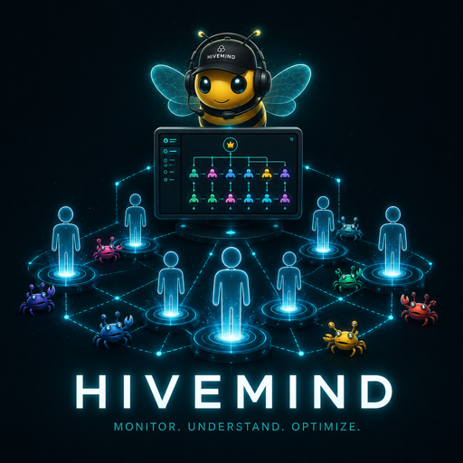
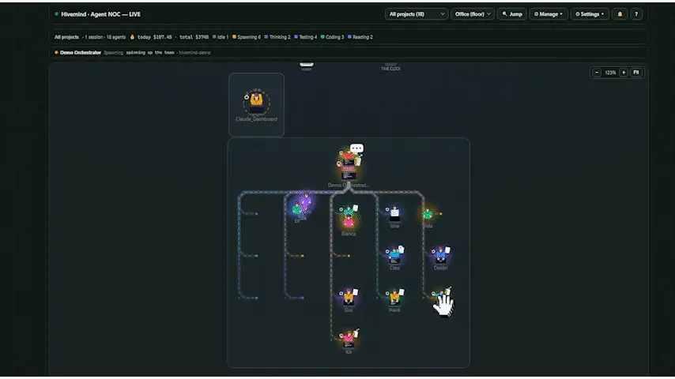
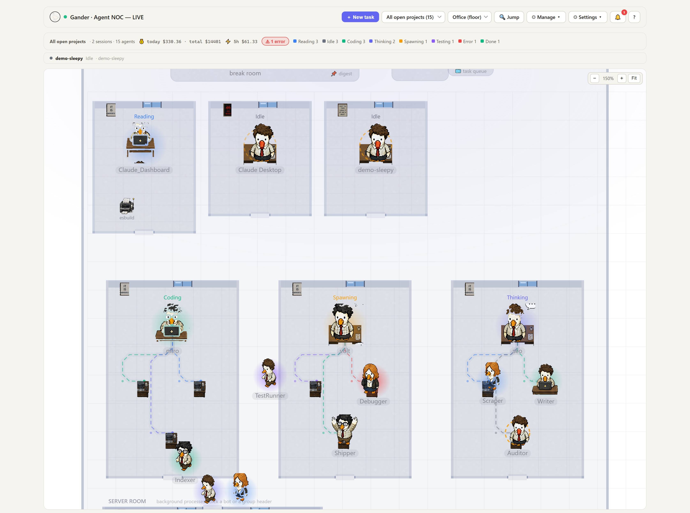

<p align="center"></p>

# Gander

> *Take a gander at your agents.* The ambient control room for Claude Code — see every agent, get pinged anywhere the moment one needs you, and keep your whole setup lean.

<p align="center"></p>

A live, animated dashboard of your **Claude Code agents and sub-agents** — an office floor where each session is a pixel-art avatar that physically acts out what it's doing: thinking, coding, spawning sub-agents, testing, erroring, idling. It attaches to any project automatically via Claude Code **hooks** — no manual wiring once installed.

> **Claude Code ships a built-in agent list (`claude agents`).** Gander is the layer around it: it **reaches you when you've stepped away** — desktop toast, phone, even a smart light across the room — and it's a **control center for your whole Claude Code setup**: CLAUDE.md health, cost and runaway burn, stuck processes, every project's skills / MCP / hooks.

<p align="center"></p>
<p align="center"><em>idle · thinking · coding · spawning · reading · testing · error · done — every agent, live.</em></p>

<p align="center"><a href="https://youtu.be/URRkwBjsVmQ"><strong>📺 Watch the demo</strong></a> — running a dozen Claude Code agents at once</p>

<p align="center"><a href="https://www.paypal.com/ncp/payment/G8NNLNUHD6SFW"></a></p>

## Highlights

- **Live office floor + Mosaic** — a structured top-down office: every session in its own **walled room with a doorway**, rendered as pixel-art **geese** whose poses act out the state (typing, thinking, facepalm on error, celebrating on done); agents walk *through the doors* to the water cooler and clock out when finished.
- **🤖 Process robots + SERVER ROOM** — every background process your sessions leave running, visualized, attributed to its real owner, and killable — with verdicts like *parked 2 days, safe to close* vs *has live work*.
- **🔔 Needs-you rail** — who's waiting on input, errored, or **went quiet mid-goal**, across all projects; answer inline, or ✓ Allow / ✕ Deny the exact permission.
- **⚡ Gander Dispatch** — host sessions inside the bridge: instant replies, real permission buttons, live plan-window telemetry. Your own `claude` login, plan quota, **no API key**.
- **💸 Cost guardrails** — live per-session spend, `$/min` runaway alerts, daily/per-session budgets with an optional hard stop, and 5-hour plan-window pacing.
- **📊 Session analytics + CLAUDE.md audit** — cache-hit %, context-window fill, a one-click `/compact` nudge, and a deterministic CLAUDE.md trimmer that flags secrets, dead paths, and stale prose.
- **⏪ Session replay** — scrub any session's timeline: what ran when, with cumulative tokens/cost at every moment.
- **📋 Task queue · 📰 Ship digest · Routines** — line up goals per project (with **⎇ worktree isolation** to run several tasks in one project in parallel, a **🧪 test gate** so only green branches merge back, `then:` chaining, and retry-with-context on failures), see what actually got done, schedule headless morning briefings.
- **Projects control center** — skills, agents, commands, hooks, MCP, `settings.json`, git status/commit/push — for every project, in one place.
- **Tune + Skills usage** — deterministic mining of your own transcripts: your prompting "turn tax" with copy-paste fixes, and which skills actually get used (never-used = context dead weight).
- **🖥 Fleet + Claude Desktop** — all your machines' agents on one floor; a view-only tile for the Claude desktop app.
- **📱 Anywhere** — installable PWA for your phone, **Telegram or Slack** two-way chat (reply to agents, `/task` queueing, alerts — Slack via Socket Mode, zero deps), native desktop toasts, smart-light ambient alerts.

**The full feature reference, with every detail: [docs/FEATURES.md](docs/FEATURES.md).**

## Screenshots

<p align="center"></p>
<p align="center"><em>The Office floor — goose agents in walled offices inside one building: doorway-routed walking, a break room, a Ticket Bot queue desk, and process droids in the server room.</em></p>

<p align="center">
  
  &nbsp;
  
</p>
<p align="center"><em>Click any agent to read its task, reply, or stop it (left). A runaway session lights up red with a 💸 $/min badge (right).</em></p>

<p align="center"></p>
<p align="center"><em>Usage &amp; cost — real spend parsed from your <code>~/.claude</code> transcripts.</em></p>

## Install

**Requirements:** [Node.js](https://nodejs.org) and Claude Code.

```bash
# Windows
setup.bat                  # global: every Claude session on this machine reports in

# macOS / Linux
./setup.sh
```

Then run `/hooks` in any open session (or restart it). The dashboard is **prebuilt** — nothing to compile. On your next session the bridge starts itself and opens **http://localhost:3131**. Remove everything with `node uninstall.js`.

Full setup — scoped installs, ⚡ Dispatch, Telegram, budgets, smart lights, the VS Code extension, plugin install, and every config knob: **[docs/INSTALL.md](docs/INSTALL.md)**.

## Documentation

| Doc | What's in it |
|---|---|
| [docs/FEATURES.md](docs/FEATURES.md) | The full feature reference — floor, robots, Dispatch, rail, analytics, control-center panels |
| [docs/INSTALL.md](docs/INSTALL.md) | Setup, optional features, VS Code extension, plugin install, configuration reference, other models |
| [docs/ARCHITECTURE.md](docs/ARCHITECTURE.md) | How the hooks wire up, file layout, event API, manual/headless control, contributing |
| [docs/FAQ.md](docs/FAQ.md) | Common questions — also in-app under the **?** button |
| [docs/REMOTE.md](docs/REMOTE.md) | Phone (PWA), Tailscale/cloudflared, multi-machine fleet, access tokens |

## Platform support

Developed and exercised daily on **Windows**; the dashboard, bridge, and data features are plain Node + browser and should work anywhere — the OS-specific surface is window automation (details in [docs/ARCHITECTURE.md](docs/ARCHITECTURE.md)). **On macOS or Linux? Please give it a spin and open issues/PRs.** 🙏

## Support

Gander is free and always will be. If it saves you time (or money), you can [**buy me a coffee** ☕](https://www.paypal.com/ncp/payment/G8NNLNUHD6SFW) — and a ⭐ on the repo genuinely helps.

## License

**MIT** — free and open source. Use it, fork it, ship it. Issues and PRs welcome.
