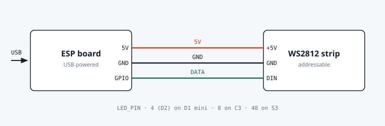
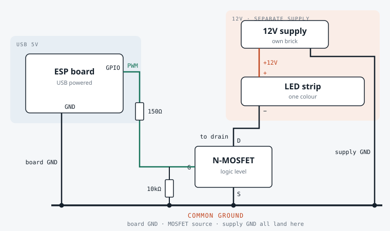

# Build a $4 ambient alert lamp

Gander's **ambient alerts** POST a small JSON body whenever something happens. A smart bulb is one way to catch it. A WiFi microcontroller costs a fraction of one and does more.

This folder has working firmware: [`ambient-lamp/ambient-lamp.ino`](ambient-lamp/ambient-lamp.ino).

Powered by **one USB port**. No hub, no cloud, no account.

---

## Parts

| Part | Why | Rough cost |
|---|---|---|
| **ESP32-C3 SuperMini** *or* **Wemos D1 mini (ESP8266)** | WiFi + USB power in one board | $2 – $4 |
| **WS2812B stick (8 LEDs)** or ring (16) | the actual light | $1 – $3 |
| 3 jumper wires | strip → board | pennies |
| USB cable you already own | power | $0 |

**Total: about $4** from AliExpress, **about $12** from Amazon (same parts, faster).

### Boards that work

The firmware builds for any ESP8266 or ESP32 without edits. Set two defines and upload.

| Board | Onboard RGB | `LED_PIN` | Cost | Verdict |
|---|---|---|---|---|
| **ESP32-C3 SuperMini** | usually yes | `8` | $2 – $4 | Cheapest complete lamp |
| **Wemos D1 mini (ESP8266)** | no | `4` (pin D2) | $2 – $4 | Fine, needs a strip |
| **ESP32-S3-DevKitC-1** | yes | `48`, or `38` on some revisions | $8 – $15, but often within ~$1 of the C3 on Amazon | **Best headroom.** Buy this if the gap is small |
| **ESP32 DevKit / S2 / C6** | varies | check pinout | $4 – $10 | Works the same |

**Which to buy:** on AliExpress the C3 SuperMini is the value pick. On Amazon the two are often within a dollar of each other, and at that gap the **S3-DevKitC-1 is the better buy** — same zero wiring, far more room to grow (see below). Set `LED_PIN 48` and `LED_COUNT 1`.

Two things specific to that board:

- It has **two USB ports**. Flash through the one marked **UART**. That is the least fussy path.
- If you use the port marked **USB** instead, turn on **Tools → USB CDC On Boot** or the Serial Monitor stays empty.

### What the extra headroom buys you

The alert payload carries more than a colour. It also has `project`, `agent`, `reason` and `state`. A bigger board can act on all of it, using endpoints the bridge already serves:

| Idea | What it needs | API that already exists |
|---|---|---|
| **A small screen** showing *which* project needs you and why | ST7789 or SSD1306, a few GPIO | `GET /api/statusline` returns `needsYou`, `queued`, `running`, `review`, `escalations`, `gems` — built for a one-line display |
| **Physical Allow / Deny buttons** for permission prompts | 2 buttons | `GET /api/permissions` lists what's waiting; `POST /api/permissions/answer` with `{sessionId, requestId, behavior}` answers it |
| **An approve-the-merge button** | 1 button | `POST /api/queue/action` with `approve` or `request-changes` |
| **Sound instead of light** | I2S amp | any of the above events |

That is the real argument for the S3: it stops being an output-only lamp and can become the thing you press to answer the rail without touching the keyboard. The C3 can do a cut-down version; the S3 has the pins and the RAM to do all of it at once.

None of that is built yet. The lamp firmware here is the starting point.

### Cheapest possible version

Buy the **ESP32-C3 SuperMini alone (~$3)**. Most of them have an RGB LED on board (GPIO8).

Set `LED_PIN 8` and `LED_COUNT 1`. One board, one cable, full colour. No soldering, no wires.

It is small, so it works best as a desk-edge indicator rather than a room light.

---

## Wiring an addressable (WS2812) strip



| Strip pin | Board pin |
|---|---|
| 5V / VCC | `5V` (D1 mini) or `5V` / `VBUS` (C3) |
| GND | `GND` |
| DIN | `D2` on D1 mini (GPIO4), or any free GPIO on C3 |

Keep `MAX_BRIGHTNESS` at 70 or below. A USB port supplies 500 mA, and 8 LEDs at full white would draw close to that on their own.

If the LEDs flicker, the 3.3V data line is marginal. Put one ordinary diode (1N4148) in the strip's 5V line. That drops it to about 4.4V and the strip then reads 3.3V data cleanly.

---

## Using single-colour strips you already own

Have spare rolls of plain one-colour strip? The firmware drives those too. Set `MONO_PIN` to a free GPIO and it runs the same patterns on a PWM output.

You can run both at once: the onboard RGB for detail at the desk, the roll for a wash across the room.

### The power part matters

**A 12V roll cannot run from USB.** Five metres of 5050 at 60 LEDs/m pulls roughly 6A at 12V, about 72W. A USB port gives 2.5W.

So: **the board stays on USB, the strip gets its own 12V supply.** That is the only safe split.

If your rolls happen to be **5V**, a short piece of about 20 to 30cm can share the USB supply. Longer than that and you are over budget again.

### What to add

| Part | Why | Cost |
|---|---|---|
| Logic-level N-MOSFET module | GPIO pins cannot switch amps | $1 – $2 |
| 12V power brick | feeds the strip | often already in the box |

A ready-made **"MOSFET trigger switch module"** is the easy path. Wire in, wire out, signal pin. No component theory.

Building it from a bare part instead? Use a **logic-level** MOSFET such as an IRLB8721 or AO3400. A standard IRF540 will not switch properly from 3.3V.

### Checking a MOSFET you already have

Two numbers in the datasheet settle it:

| Look for | Good | Bad |
|---|---|---|
| `R_DS(on)` quoted at **V_GS = 4.5V** | listed, in milliohms | only quoted at V_GS = 10V |
| `V_GS(th)` max | about 1 to 2V | 3V or more |

If on-resistance is only given at 10V of gate drive, a 3.3V pin cannot turn the part on properly. And on-resistance in **ohms** rather than **milliohms** means it drops voltage and makes heat even when it does switch.

Two parts that commonly turn up in a drawer, and why neither works here:

- **2SK3067** — no. A 600V 2A switching-supply part: threshold 2 to 4V, and `R_DS(on)` of **4.2Ω**. That is roughly 260 times the resistance of an IRLB8721. Even driven at a full 10V it would drop several volts across itself and turn the difference into heat.
- **MBR2045CT** — not a switch at all. It is a Schottky **rectifier**: two diodes sharing a cathode, no gate, nothing to control. Keep it for reverse-polarity protection on the 12V input if you like. It cannot switch anything.

Anything whose part number starts `MBR`, `SB`, `1N` or `BAT` is a diode, not a transistor. A Schottky also drops *less* than the 1N4148 mentioned above, so it is not a substitute in the data-line trick either.

### Wiring



The MOSFET sits in the strip's **negative** leg, so the board switches the roll without ever carrying its current. The two supplies meet at exactly one place: the ground rail.

| From | To |
|---|---|
| 12V supply **+** | strip **+** |
| strip **−** | MOSFET **drain** |
| MOSFET **source** | **GND** |
| MOSFET **gate** | your `MONO_PIN` GPIO, through ~150Ω |
| gate → GND | 10kΩ resistor, keeps it off during boot |

**Two rules that matter:**

1. **Tie the grounds together.** The 12V supply ground and the board ground must be the same ground, or nothing switches.
2. **Never feed 12V into the board.** The 12V goes to the strip only. The board stays on USB.

### Pick patterns that don't collide

A single colour cannot say *which* alert fired. Only the pattern can. And the defaults collide: `awaiting` and `done` are both **pulse**.

So set these in **Settings → Ambient alerts** to keep all five distinct:

| Event | Pattern on a mono strip |
|---|---|
| `awaiting` | pulse |
| `error` | blink |
| `runaway` | strobe |
| `done` | breathe |
| `clear` | colour `off` |

Colour still works normally for the RGB LED, so you can set both and each output uses what it can. On the mono channel the brightest colour channel simply becomes brightness, so anything lit reads as on and only `off` goes dark.

---

## Flash it

1. Install the **Arduino IDE**.
2. Boards Manager → add **esp8266** or **esp32**, then pick your board.
3. Library Manager → install **Adafruit NeoPixel**. That is the only library.
4. Open `ambient-lamp/ambient-lamp.ino`. Uncomment the one `BOARD_` line that matches your board, then fill in your WiFi name and password. That is all the editing there is.
5. Upload. Open the Serial Monitor at **115200** to see the address it got.

---

## Point Gander at it

**⚙ Settings → App configuration → 💡 Ambient alerts**

In each scenario's **webhook** field:

```
http://gander-lamp.local/alert
```

If `.local` names don't resolve on your network, use the IP the Serial Monitor printed, for example `http://192.168.1.42/alert`.

Hit **Test** in Settings. The lamp should react immediately.

Open `http://gander-lamp.local/` in a browser for a status page with its own test buttons.

---

## What each alert looks like

Gander's defaults, which you can change per scenario in Settings:

| Event | Meaning | Colour | Pattern |
|---|---|---|---|
| `awaiting` | a session needs you | amber | pulse |
| `error` | an agent hit an error | red | blink |
| `runaway` | burning money fast | red | strobe |
| `done` | a task finished | green | pulse |
| `clear` | all handled | off | solid |

The firmware understands every pattern Gander sends: `solid`, `blink`, `pulse`, `breathe`, `strobe`, `rainbow`. Colours can be names (`amber`, `red`, `limegreen`) or hex (`#F59E0B`).

---

## The payload, if you'd rather build your own

Any device that accepts an HTTP POST works. This is what arrives:

```json
{
  "event": "awaiting",
  "color": "amber",
  "effect": "pulse",
  "project": "shop",
  "agent": "session name",
  "reason": "waiting on your input",
  "state": "awaiting",
  "at": 1789019330000
}
```

Prefer a script over a device? Use the **command** field in the same Settings section instead. Gander runs it with `AOC_EVENT`, `AOC_COLOR`, `AOC_EFFECT` and `AOC_PROJECT` in the environment.
